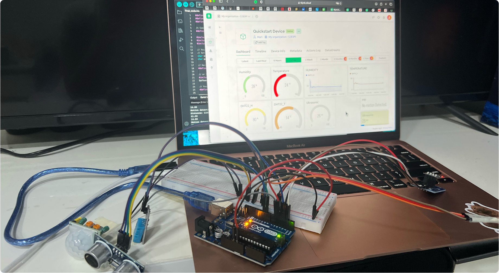

# 📡 Wire Whisperers: Disease Prevention System for Student Classrooms

**Wire Whisperers** is an IoT-based smart system designed to prevent the spread of seasonal diseases in classrooms by monitoring indoor/outdoor temperature, humidity, motion, and student distancing using Arduino and Blynk.

---

## 🎯 Project Overview

This system:
- 📡 Collects real-time environmental data (temperature, humidity, motion, and distance)
- 📲 Displays the data on the **Blynk dashboard** via WiFi
- 🧠 Helps maintain classroom health by monitoring comfort levels and spacing
- 📊 Supports informed decision-making with continuous data logging

---

## 🛠 Hardware Used

- Arduino Uno
- ESP-01 WiFi Module with adapter
- DHT11 (Indoor Temp/Humidity Sensor)
- DHT22 (Outdoor Temp/Humidity Sensor)
- PIR Motion Sensor (Presence detection)
- Ultrasonic Sensor (Student distancing)
- Breadboard, jumper wires, USB cable

---

## ⚙️ System Features

- 📶 **WiFi Integration**: Real-time data push via ESP-01
- 🌡️ **Environmental Monitoring**: Ideal classroom comfort range
- 👁️ **Motion Detection**: Detect student presence in classroom
- 📏 **Distance Measurement**: Maintain 1m student spacing
- 📈 **Data Logging**: Collect and analyze sensor data over time

---

## 📲 Dashboard View

The real-time interface provides intuitive data visualization on the Blynk IoT app:

Features:
- Temperature & humidity dials for both indoor and outdoor readings
- Motion status updates (detected / no motion)
- Ultrasonic distance in centimeters

---

## 🧠 Arduino Code

Main sketch: [`code/Arduino/disease_prevention.ino`](./code/Arduino/disease_prevention.ino)

Libraries used:
- `DHT`
- `SoftwareSerial`
- `ESP8266_Lib`
- `BlynkSimpleShieldEsp8266`
- `NewPing`

---

## 📈 Data Logs

- [`sample_data.csv`](./data/sample_data.csv) – 5-day sensor readings
- [`analysis_summary.txt`](./data/analysis_summary.txt) – Summary & insights

---

## 📝 Full Report

See [`/report`](./report) for the detailed project documentation:
- `WireWhisperers_Report.pdf`
- `WireWhisperers_Report.docx`

Covers design, challenges, code, and recommendations.

---

## 📷 Project Visuals

See the [`/visuals`](./visuals) folder for hardware setup and circuit photos:
- Sensor placements
- Breadboard layouts
- Wiring closeups
- External sensor mounting

---

## 📜 License

This project is licensed under the **MIT License** – feel free to use, modify, and distribute with proper attribution.
